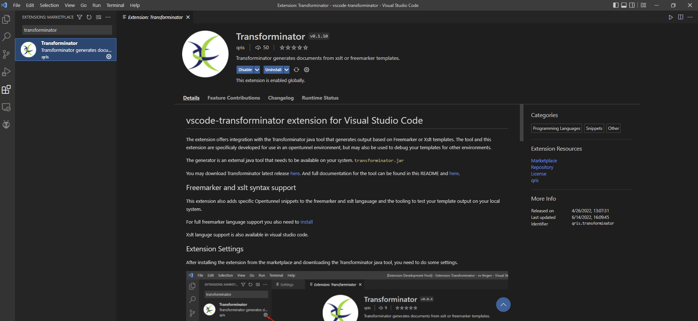

# Transforminator tool

This tool is to test Freemarker and Xslt templates that can be used in message tranformations in the opentunnel environment. The tool is also suitable for other environments but has some specific functionalities to support the Opentunnel runtime variables.
For convenience you best use this tool with the [Transforminator Visualstudio code extension](https://marketplace.visualstudio.com/items?itemName=Qris.transforminator). 



The tool requires a minimal java version 1.8.

- [Transforminator tool](#transforminator-tool)
  - [Usage](#usage)
    - [Options](#options)
    - [Visual studio code](#visual-studio-code)
  - [Debugging](#debugging)
  - [tunnelvariables or templatevariables](#tunnelvariables-or-templatevariables)
    - [constant variables](#constant-variables)
    - [file content](#file-content)
    - [tunnelfunctions](#tunnelfunctions)
    - [function](#function)
    - [mappings](#mappings)
    - [XPath and jsonpath](#xpath-and-jsonpath)
    - [xmlns  xml namespace](#xmlns--xml-namespace)
    - [header](#header)
    - [Freemarkerversion](#freemarkerversion)
    - [xslt factoryname](#xslt-factoryname)
    - [attachments](#attachments)
    - [multipart formdata](#multipart-formdata)
    - [exitpoint](#exitpoint)
    - [expressions (Not OpenTunnel compatible)](#expressions-not-opentunnel-compatible)
  - [Example setup](#example-setup)
    - [vars.tunnelvars file](#varstunnelvars-file)
    - [The Freemarker template.ftl](#the-freemarker-templateftl)
    - [Example Groovy script](#example-groovy-script)
    - [Input xml](#input-xml)

## What is new

- Stability is improved
- mappings functionality
- query functionality on csv files
- groovy transformer support (no opentunnel specific functions yet)

PLEASE UPDATE YOUR Transforminator VisualStudioCode plugin as well.

## Usage

` java -jar ~/tools/Transforminator.jar -a vars.tunnelvars -t template.ftl -x input.xml -o output.xml`

### Options

```bash
version 2.10

usage: java -jar Transforminator.jar
 -a,--vars <arg>             vars input file path
 -t,--template <arg>         freemarker,xslt or groovy template file
 -x,--xml-input <arg>        xml input filepath
 -j,--json-input <arg>       json input filepath
 -i,--text-input <arg>       text input filepath
 -o,--output <arg>           output file
 -f,--function-dir <arg>     Function dir
 -g,--groovy-lib-dir <arg>   groovy lib path
 -r,--resolve <arg>          outputfile with resolved variables
 -s,--xsd-schema <arg>       xsd schema filepath
 -v,--validate               validate resulting xml file
```

When a templatefile with the `.xsl` extension is supplied to the template option `-t` the xslt generator wil be invoked. When you use a template with `.ftl` extension the freemarker generator is used. You may also supply a groovy script as a template with the `.groovy` extension then the groovy generator wil be invoked. All generators can make use of the supplied tunnelvars.

The tunnelvars are supplied using the `-a` option to the command. There is de posibitity to save the resolved tunnelvars to a separate file with the `-r` option. In the file all resolved variable values are stored so you can see what exact values were used when the template was evalueated. (works for freemarker and xslt templates)

The groovy template script can use the `println("...")` to produce output and/or `return` a string to be used as a script result. When the script returns no value with the `return`statement all `println` output will be placed in the outputfile indicated by the `-o`commandline option.

### inputfiles

You can use either use the xml-input `-x`, json-input `-j` or text-input `-i`, never together.
When using the `-i` option the file is being parsed based on the extension.
- .xml  - xml gets parsed and the dom model is available in freemarker `payloadElement` variable
- .json 
- .csv  - csv is parsed and available through the `payloadHelper` freemarker variable (not in Opentunnel)
- .yaml - yaml is parsed and available through the `payloadHelper` freemarker variable (not in Opentunnel)

#### payloadMessage

The payloadMessage has some generic functions:
- getPayload()       - return the initial payload as a string
- getPayloadElement()- returns the Object representation of the inputfile.
  - for json and yaml the returned object wil be a JsonNode object
  - for xml we return a NodeModel
  - for csv the returned object will be a Map object
- getPayloadString() - returns the string as it was read from the inputfile.
- getJsonPayload()   - returns the JSon representation of the inputfile
- getJsonPayloadElement() - The json representation for the message data
- getXmlPayload()    - returns the Xml payload
- getXmlPayloadElement() - The xml representation for the message data
- getDataObject()    - the internal data object for the message
  - for Json and Yaml this is a Map
  - for xml this is a NodeModel
  - for csv this is a list of lists
- getContentType()   - returns the contenttype for the message in string format.

Xslt has no support for this functionality.
In Freemarker you may use the short version of the methods like this:
```
${payloadMessage.payload}
${payloadMessage.jsonPayload}
<#assign obj = payloadMessage.dataObject>

${payloadMessage.payloadElement[0].KEY}
```
for yaml you should iterate a map:
```
<#list obj?keys as k>
  ${k}
</#list>
```
for csv you iterate a List (example to xml)
```freemarker
<rows>
<#list rows as row>
    <row>
    <#list payloadMessage.headers as header>
        <${header}>${payloadMessage.value(header?counter,header)}<${header}>
    </#list>
    </row>
</#list>
</rows>
```

The payloadMessage for csv inputfiles has some more specific csv methods.
- `getSize()` - the number of rows in the csv (without the header)
- `getHeaders()` - the List with all header names
- `getStringHeaders(separator)` - String representation of the headers, you must supply the separator string
- `getRow(rownum)` - Get the row by its row number as a List object
- `getJsonRow(rownum)` - get the Json string representation of the requested row
- `getStringRow(rownum, separator)` - get the String representation of the row by its number, you also supply the separator string.
- `getValue(rownum,colnum)` - get a value by its row and column number
- `getValue(rownum,headername)` - get a value by its row number and column name
- `getColIndex(headername)` - get the column number by its name
- `getLastRow` - get the lastrow as a list

```freemarker
${payloadMessage.getStringHeaders("|")}
```

The xml dom is made available through `payloadElement`  this is the objectrepresentation for the xml data structure. When you supply a json file the ``xpath://`` tunnelvariables will work just like with an xml input file.

The output file `-o` can be of any type for freemarker, for xslt it will be mostly `.xml`

When generating xml output you can validate the generated xml using a specified schema with the `-s` option combined with the `-v ` option. You may also use the `-v` option with no schema, the xml is just validated to be valid xml (no schema is used then).

There are some special options to the Transforminator tool. You may define a directory where you keep your groovy functions `-f`. In this way you do not have to copy them from project to project.
From your groovy functions there is the possibility to use additional `.jar` libraries. You may supply this library-path with the `-g` option. When Opentunnel or some other environment uses some specific api's from the freemarker templates, you can use them from the `.jar` library.

### Visual studio code

This tool is best used in combination with [Visual Studio Code](https://code.visualstudio.com/download). Install the [extension Transforminator](https://marketplace.visualstudio.com/items?itemName=Qris.transforminator) to add additional editor features.

## Debugging
When an error occurs in the template all known variables are dumped in the output file.
This way the user has an insight what the variables contained at the time of the error.

Also ther is a possibility to make the tool dump all variables at a specific point by adding
`${DEBUG()}` at some point in your template. Then all variables are dumped in the outputfile at the 
point of the DEBUG statement.

You may add a variable to the DEBUG statement so only that variable is dumped to your output file.
`${DEBUG("varname")}`
when the first argument starts with a : the folowing character is used to format the debug string;
- `:l` debug format is single line only

`${DEBUG("varname")}` prints like

```
_________________ DEBUG info __________________
{
  "DebugVariables" : {
    "varname" : "NUL0"
  }
}
_______________ END DEBUG info ________________
```

`${DEBUG(":l","varname")}` prints like
```
DEBUG -> {"DebugVariables":{"i":"NUL0"}}
```
For simple variable structures the :l is more preferable.

## tunnelvariables or templatevariables

You can add your tunnelvars to the `vars.tunnelvars` file
You may also use concatenation of tunnelvars to create a new variable.

``name=const://testtunnelvar://extension`` is invalid

### constant variables
``name=value`` or ``name=const://value``

### file content
Use the content of a file as the value:

``name=file://filepath``

### tunnelfunctions

You may use functions in your template by first adding the definition to the tunnelvars file.
The value is then the file path to the script.

``function://function_name=groovy://script.groovy``

The groovy script has all the tunnelvars available as variables 
and also accepts parameters from your freemarker template. 
These parameters can be just a string or another tunnelvar.

So in your template use the tunnelfunction like this;

``${tunnelFunction("helloworld",myname)}``

⚠️When the tunnelfunction is used from the freemarker template the groovy script is then executed. The groovy engine in Transforminator has only access to some specific OpenTunnel classes
So in the case you do use specific OT classes most of them may not work here.

When you might need java jar libraries you may place them in a directory and use the `-g` option to define the path to that directory. The Transforminator scans and loads all jar files in that directory.

Look below for an example groovy script.

### function

When you have defined your function with ``function://name=groovy://script.groovy`` You can call this function
from the next tunnelvar;

``varname=function://`function_name/varx``

The varname is then initialized with the return value of your groovy script.

### mappings

To make use of the opentunnel mapping functionality you may add your mapping tables by using the `mapping://` definition.
The most convenient way is to use a csv file for input to your mapping.

``mapping://maptable=file://mappinginput.csv``

After this the mappingtable with name `maptable` is available to create your tunnelvars like it is supported in opentunnel;

```
mapping://maptable=file://mapping_input_file.csv
someCode=const://code
varname=function://mapping/maptable/someCode
```
The variable `varName` now contains the value that was in the csv file for key code

Or you may query the mapping using SQL language, this functionality is not supported in opentunnel but may be used when using Transforminator for generic purposes.

```
mapping://mydb=file://mapping_input_file.csv
resultlist=query://SELECT * from mydb WHERE name='Harry Potter'
```

resultlist now contains a list of rows that match the selection you may use the tunnelvar resultlist in freemarker like anyother List.

#### Freemarker
In your Freemarker template you can also access the mappings in the following way.

```freemarker
mappingName.map["keyname"]
```

The mappingsResolver is also available in your freemarker template (not supported by opentunnel). 
From the template you can query the mapping like it is a Database table.

```freemarker
${mappings.query("select * from mydb where name=\'Harry Potter\'")[0].Year}
```

#### For Saxon

From Opentunnel version 3.1 you may use the mappings in the Xslt transformations: This can be tested with the Transforminator tool as well;

first define the mapping in your tunnelvars file;

``mapping://otmap=file://mappings.csv``

For Saxon the template may look like this:
```xml
<xsl:stylesheet version="3.0"
                xmlns:xsl="http://www.w3.org/1999/XSL/Transform"
                xmlns:javamap="http://www.w3.org/2005/xpath-functions/map"
                exclude-result-prefixes="javamap xsl">
    <xsl:param name="otmap"/>
    <xsl:param name="DEBUG"/>

    <xsl:output omit-xml-declaration="yes" indent="yes" encoding="utf-8" method="xml"/>
    <xsl:strip-space elements="*"/>

    <xsl:template match="/">
        <start><xsl:value-of select="javamap:get($otmap, 'code')"/></start>
    </xsl:template>
</xsl:stylesheet>
```

#### For Xalan and JDK

Define the mapping as shown above, and your template may look like this;

```xml
<xsl:stylesheet version="3.0"
                xmlns:xsl="http://www.w3.org/1999/XSL/Transform"
                xmlns:attrmap="xalan://nl.jnc.gateway.configuration.dto.AttributeValueMapping"
                xmlns:javamap="xalan://java.util.Map"
                exclude-result-prefixes="attrmap javamap xsl ">
    <xsl:param name="otmap"/>
    <xsl:param name="DEBUG"/>

    <xsl:output omit-xml-declaration="yes" indent="yes" encoding="utf-8" method="xml"/>
    <xsl:strip-space elements="*"/>

    <xsl:template match="/">
        <start>
            <xsl:value-of select="javamap:get(attrmap:getMap($otmap), 'code')"/>
        </start>
    </xsl:template>
</xsl:stylesheet>
```

### CSV Query's

This functionality is not supported in Opentunnel and only SELECT query's are supported.

You may query a csv file using an SQL query. The CSV file should contain column data with header-names.

```
mapping://mydb=file://dbfile.csv
varname=query://SELECT * from mydb
```

SQL SELECT queries must be of the following format.

```sql
SELECT [DISTINCT] [table-alias.]column [[AS] alias], ...
FROM table [[AS] table-alias]
WHERE [NOT] condition [AND | OR condition] ...
GROUP BY column ... [HAVING condition ...]
ORDER BY column [ASC | DESC] ...
LIMIT n [OFFSET n]
```

### XPath and jsonpath

When working with xml or json input files you may also use the `xpath://` or `jsonpath://` directive. 

``varname=xpath://ns:element`` 

It should work just like in opentunnel.
The jsonpath works just like the xpath, the json payload is first transformed to a xml-object model and then the jsonpath (xpath) is resolved.

### xmlns  xml namespace
When using xpath variables, you may need to add the `xmlns://` as well.

`xmlns://soap=http://schemas.xmlsoap.org/soap/envelope/`

you can then use the namespace in your xpath variables.

When using xpath from your template you need to add the xmlnamespace in the template ftl header as well.

```
<#ftl ns_prefixes={"e":"http://example.com/ebook"}>
```
### header

Freemarker transformations used by Opentunnel often make use of the headers that came with
the received message. in the tunnelvars file you can add these headers in the folowing way.

``header://soapaction=myAction``

These headers can then be used in groovy scripts by the folowing Freemarker Bean:
The MessageHeader class is not a full implementation like in OpenTunnel. It is more like a mock class to mimic the OpenTunnel version.
``` groovy
import nl.jnc.gateway.message.dto.MessageHeader;

def result = [:]

MessageHeader mh = messageheader;

mh.transportParametersMap.each { key, val ->
    if (!key.startsWith('opentunnel')) {
        result[key] = val
        println(key)
    }
}

return result
```

### Freemarkerversion

The freemarker engine supports several versions. The freemarkerversion can be definded by the OpenTunnel version

`opentunnelVersion=3.0` Gives freemarkerversion 2.3.30 All other OT versions lead to freemarkerversion 2.3.28

supported OT versions are:
- ``3.0`` uses Freemarker version 2.3.30
- ``2.4`` uses Freemarker version 2.3.28
- ``2.2`` uses Freemarker version 2.3.28

You may also define the freemarkerversion to be used explicitly.

`freemarkerVersion=2.3.28`

supported freemarker versions are:
- ``2.3.30``
- ``2.3.28``
- ``2.3.27``
- ``2.3.26``
- ``2.3.25``
- ``2.3.24``
- ``2.3.23``
- ``2.3.22``

### xslt factoryname

For the xslt processor you can define what factoryname should be used. You can do this by defining the processor in your tunnelvars file.

- jdk
- xalan
- saxon

``processor=xalan`` or use:

``xslt.transformer.factory=saxon`` the prefered OT way for xslt templates.

Why use saxon?

Saxon an XSLT 2.0 and XSLT 3.0 processor, it is very actively developed and maintained.
Its developer, Dr. Michael Kay is the Editor of the W3C XSLT WG (Working Group) and thus he is probable the one that best understands the XSLT Specification and this shows in Saxon. Any language feature is strictly and precisely implemented -- usually well ahead of other vendors.


### attachments

You may use attachments from the tunnelvars file. You can just add a specific value to them or use the content of a specific file.

``attachment://name=file://filepath``

``attachment://name=value``

The attachment is then available through the `form.attachment.1`

### multipart formdata

Multipart formdata that is not a file attachment is parsed as a ``url_`` tunnelvar. You may use a file or a value to parse.

``url_name=file://filepath``

``url_name=value``

### exitpoint

``exitpoint://EXP_OUT=GET:application/json:http://localhost:8441/mock/service``

This entry needs the METHOD:content-type:URL

From your template you can use the Opentunnel `deliveryPointAttachment` function to send a message to the exitpoint using its code/name

```ftl
<#assign val = deliveryPointAttachment(payload,"EXP_OUT")>
```

### expressions (Not OpenTunnel compatible)
For convenience there is also the posibility to use expressions. This is not supported bij Opentunnel so do not use it in your tunnel runtimevariables.
The expressions are based on a java like syntax.
 
```ftl
hello=test
expr=expression://hello.length
```

expr is then resolver to 4

```aidl
expr=expression://hello.length + 10
```

epr = 14

## Example setup

Here are some examples for use with freemarker.

`java -jar ~/tools/Transforminator.jar -a vars.tunnelvars -t template.ftl -x input.xml -o output.txt`

### vars.tunnelvars file

The file contains a set of key/value pairs that normaly are configured in the opentunnel as tunnelvars. Or that are parsed to the template in the runtime.
 

```properties
#use ${DEBUG()} in your freemarker template to dump vars in your output
#xpath always prefix with xpath:// never only //

#definitions like xmlns:// and header://
xmlns://person=http://test.org/persons/
header://action=soapaction
function://uuid=groovy://UUID.groovy
exitpoint://CODE=GET:text/xml:http://localhost:8441/mock/service
attachment://testinput=file://test.json

#Tunnelvars
uuid=function://uuid
business=transport://soapaction
name=xpath:////person:name
street=xpath:////person:street

business=tunnelvar://nameconst:// - tunnelvar://street
```

### The Freemarker template.ftl

```freemarker
<#ftl encoding='UTF-8' ns_prefixes={"p":"http://test.org/persons/"}>

<#assign zipcode=payloadElement["//p:zipcode"]/>
<#assign next_uuid=tunnelFunction("uuid") />

FULL DEBUG OUTPUT
${DEBUG()}

SINGLE LINE DEBUG OUTPUT
${DEBUG(":l","zipcode","name")}

{
    "user" : {
        "name": "${name}",
        "adress": "${street}",
        "zipcode": ${zipcode}
    }
}
```

### Example Groovy script

```groovy
java.util.UUID.randomUUID().toString()
```

### Input xml

```xml
<person xmlns:p="http://test.org/persons/">
    <p:name>Tibbe</p:name>
    <p:address>
        <p:street>Tibbe-street</p:street>
        <p:zipcode>1825SE</p:zipcode>
    </p:address>
</person>
```